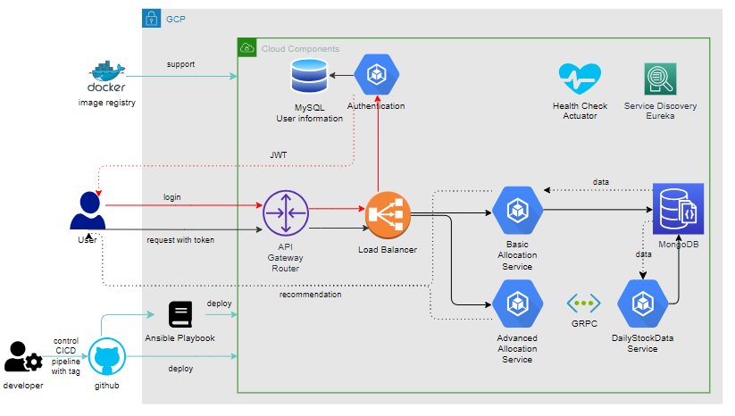

# FinancialCloud
The repo is designed to collect financial information, calculate indicators, and recommend suitable investment portfolios. 
Any information and recommendations from the API are only references for your decision. 
Please think carefully about your strategies.

# How to use
## For trial users.
### 1. Get a temporary token using the login API with the username 'Guest' and the password 'Guest'.
#### Eample:
curl -X POST "http://34.81.200.80:8080/user/login" \
-H "Content-Type: application/json" \
-d '{"username":"Guest","password":"Guest"}'

### 2.Copy the temporary token,add it to the authentication headers as a Bearer token and send the request.
#### Example:
curl -X POST "http://34.81.200.80:8080/allocation/basic" \
-H "Content-Type: application/json" \
-H "Authorization: Bearer YOUR_TOKEN_HERE" \
-d '{"symbols":["NVDA","TSLA"]}'

# Algorithms
## For trial users
#### Simple Genetic Algorithm (SGA):
SGA is an optimization and search heuristic inspired by the principles of natural selection and genetics. SGAs are used to find approximate solutions to optimization and search problems by mimicking the process of natural evolution

#### Markwotiz Algorithm: 
Markowitz mean-variance algorithm is a mathematical procedure used to determine the optimal portfolio of assets.The goal is to construct a portfolio that maximizes expected return for a given level of risk or minimizes risk for a given level of expected return.

# Overview of the cloud architecture

# Maintenance Memo
## About tags
### For basic cloud component
#### ServiceDiscovery: git push origin basic/ServiceDiscovery/{env}/{version}
#### APIGateway: git push origin basic/APIGateway/{env}/{version}
#### User Authentication: git push origin basic/Authentication/{env}/{version}

### For database component
#### Mysql server: git push origin database/MySql/{env}/{version}
#### MongoDb server: git push origin database/MongoDB/{env}/{version}

### For service component
#### Basic Asset Allocation Service: git push origin service/BasicAssetAllocation/{env}/{version}

### For Ansible Deployment 
#### service-start deployment: git push origin ansible/service-start/{env}/{version}

